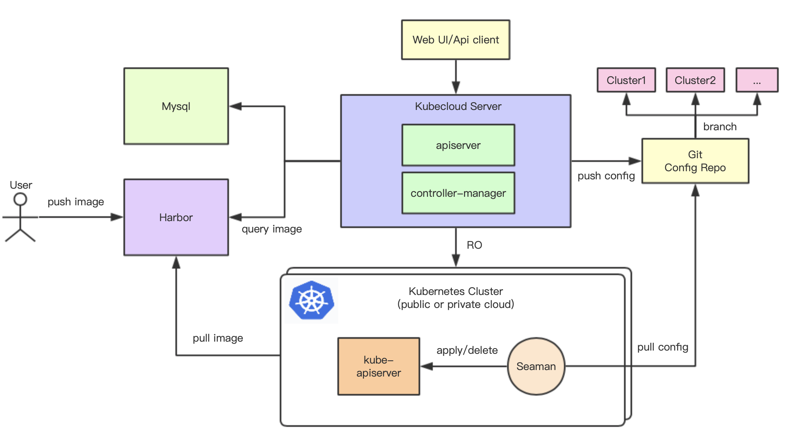

# Kubecloud

Kubecloud是一个多云多集群容器云管理平台，他可以帮助用户方便的部署和管理容器，以及搭建在公有云、私有云或自建IDC环境的K8s集群。
Kubecloud是以Gitops的方式管理各个Kubernetes集群声明式资源的yaml配置将其存放在git配置仓库中，提供安全可靠的基础设施服务。
同时Kubecloud也积极跟随云原生社区发展，后续将不断完善产品功能并向ServiseMesh、Serverless、边缘计算等方向探索。

Kubecloud的主要功能以及特性:

- 提供API服务管理k8s集群以及资源编排
- 方便易用的可视化界面
- 多云环境的k8s集群及主机、网络、存储、容器等资源管理
- 基于Harbor的镜像仓库管理功能
- 使用Gitops管理k8s集群声明式基础设施的yaml配置文件
- 应用市场功能方便快速部署海量企业级应用
- 支持基于Istio的Servise Mesh功能
- 支持基于Knative的Serverless功能
- 支持机器学习训练及模型部署
- 支持基于KubeEdge的容器化的边缘计算平台

## 架构概述

## 部署Kubecloud

### 依赖条件

1. Mysql 5.7版本或以上
2. Harbor 1.7.5版本或以上
3. K8s集群 1.12版本或以上
4. Git配置仓库,例如gitlab，github等
5. Seaman 0.1.0版本

### 使用kubernets部署

    $ kubectl apply -f deploy/kubecloud.yaml

### 使用Docker镜像部署

你可以使用以下命令启动kubecloud:
    
    $ mkdir -p $GOPATH/src/github.com/kubecloud
    $ cd $GOPATH/src/github.com/kubecloud
    $ git clone https://github.com/ZhongAnTech/kubecloud.git
    $ cd kubecloud
    $ make docker
    $ docker run --name kubecloud -d -p 8080:8080 kubecloud

### 编译源码

    $ mkdir -p $GOPATH/src/github.com/kubecloud
    $ cd $GOPATH/src/github.com/kubecloud
    $ git clone https://github.com/ZhongAnTech/kubecloud.git
    $ cd kubecloud
    $ make build
    $ ./kubecloud

## API文档
    
    http://localhost:8080/apidoc/idex.html

    

## License

Apache License 2.0, see [LICENSE](LICENSE).
